<div align="center">


<h1>Azure Bicep Modules</h1>

<p><strong>The Institutional-Grade Platform for Standardized Infrastructure Foundations, IaC Governance, and Multi-Cloud Blueprint Ecosystems.</strong></p>

[]()
[]()
[]()

<br/>

> **"Industrializing cloud infrastructure to automate blueprint foundations."** 
> **Azure Bicep Modules** is an enterprise-grade platform designed to provide a secure, measurable, and highly automated foundation for global infrastructure operations. It orchestrates the complex lifecycle of Infrastructure-as-Code—from automated module validation and multi-cloud registry reconciliation to high-throughput deployment intelligence and unified infrastructure auditing.

</div>

---

## 🏛️ Executive Summary

Ad-hoc scripts and lack of infrastructure consistency are strategic operational liabilities; lack of a standardized IaC framework is a primary barrier to organizational engineering maturity. Organizations fail to maintain cloud compliance not because of a lack of tools, but because of fragmented evaluation standards, lack of automated module validation, and an inability to orchestrate infrastructure planes with operational precision.

This platform provides the **Infrastructure Intelligence Plane**. It implements a complete **Bicep-Modules-as-Code Framework**, enabling CTOs and Platform Engineers to manage global infrastructure foundations as first-class citizens. By automating the identification of architectural regressions through real-time telemetry analysis and orchestrating the provisioning of secure performance-driven infrastructure policies, we ensure that every organizational workload—from core networking hubs to edge compute clusters—is provisioned by default, audited for history, and strictly aligned with institutional infrastructure frameworks.

---

## 📐 Architecture Storytelling: Principal Reference Models

### 1. Principal Architecture: Global Azure Bicep Modules & Infrastructure Intelligence Plane
This diagram illustrates the end-to-end flow from infrastructure telemetry ingestion and multi-cloud orchestration to module enforcement, performance validation, and institutional infrastructure auditing.

```mermaid
graph LR
    %% Subgraph Definitions
    subgraph InfrastructureIngress["Code & Blueprint Ingress"]
        direction TB
        Module_Signals["Bicep Source / Version Metadata / Dependency Graphs"]
        Policy_Definitions["Naming Standards / Tagging Rules / Security Benchmarks"]
        Consumer_Telemetry["Deployment Frequency / Failure Rates / Adoption Stats"]
    end

    subgraph IntelligenceEngine["Infrastructure Intelligence Hub"]
        direction TB
        API["FastAPI Infrastructure Gateway"]
        RegistryOrchestrator["Global Module & Registry Hub"]
        Governance_Hub["Compliance & Guardrail Hub"]
        AIOps_Validator["Drift & Security Analysis Hub"]
    end

    subgraph OperationsPlane["Distributed Infrastructure Ecosystem"]
        direction TB
        ManagedModuleNodes["Managed Standardized Blueprint Hubs"]
        ActiveRunbooks["Managed Automated Validation Runbooks"]
        DeliverySinks["Managed Infrastructure Delivery Hubs"]
    end

    subgraph OperationsHub["Institutional Data Hub"]
        direction TB
        Scorecard["Infrastructure Maturity Scorecard"]
        Analytics["Deployment Flow & ROI Velocity Stats"]
        Audit["Forensic Infrastructure Metadata Lake"]
    end

    subgraph DevOps["Bicep-Modules-as-Code Framework"]
        direction TB
        TF["Terraform Infrastructure Modules"]
        DriftBot["Productivity & Config Drift Validator"]
        ChatOps["Measurement Operations Hub"]
    end

    %% Flow Arrows
    InfrastructureIngress -->|1. Submit Telemetry| API
    API -->|2. Orchestrate Infrastructure| RegistryOrchestrator
    RegistryOrchestrator -->|3. Apply Privacy Guard| Governance_Hub
    Governance_Hub -->|4. Assess Drift| AIOps_Validator
    
    AIOps_Validator -->|5. Execute Validation| OperationsPlane
    OperationsPlane -->|6. Notify Status| ChatOps
    API -->|7. Visualize Health| Scorecard
    
    Scorecard -->|8. Track Maturity| Analytics
    Scorecard -->|9. Record Performance| Audit
    
    TF -->|10. Provision Backbone| IntelligenceEngine
    DriftBot -->|11. Inject Friction Risk| RegistryOrchestrator
    Audit -->|12. Improve Operations| ManagedModuleNodes

    %% Styling
    classDef ingress fill:#f5f5f5,stroke:#616161,stroke-width:2px;
    classDef intel fill:#e8eaf6,stroke:#1a237e,stroke-width:2px;
    classDef operations fill:#e1f5fe,stroke:#01579b,stroke-width:2px;
    classDef ops fill:#ede7f6,stroke:#311b92,stroke-width:2px;
    classDef devops fill:#e8f5e9,stroke:#1b5e20,stroke-width:2px;

    class InfrastructureIngress ingress;
    class IntelligenceEngine intel;
    class OperationsPlane operations;
    class OperationsHub ops;
    class DevOps devops;
```

### 2. The Module Lifecycle Flow
The continuous path of an enterprise IaC platform from initial integration (build) and aggregation (lint) to active analysis (scan), optimization (publish), and institutional forensic auditing (scorecard).

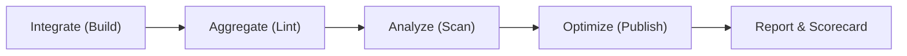

### 3. Distributed Infrastructure Topology
Strategically orchestrating standardized infrastructure across global regions, diverse resource architectures, and multi-cloud targets, providing a unified institutional view of global infrastructure health and operational readiness.

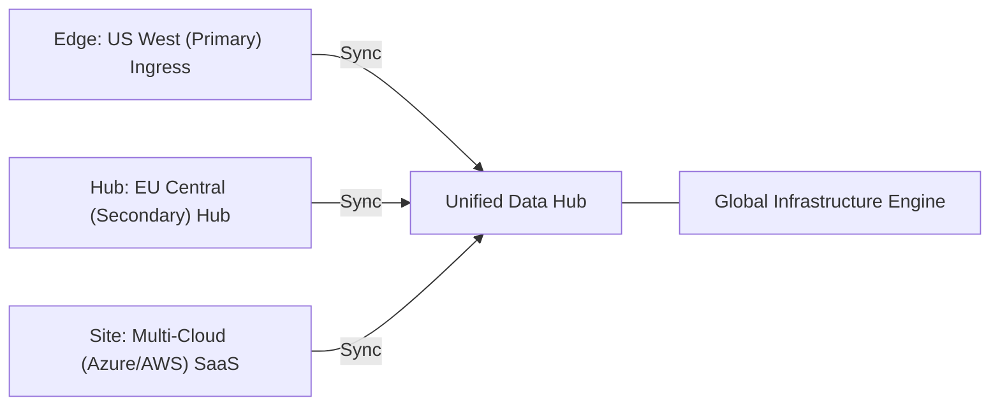

### 4. Infrastructure Hub & High-Trust Data Plane Protection Flow
Executing complex logic for securing the bridge between infrastructure owners and technical teams, ensuring every organizational identity is verified, blueprint-level privacy is maintained, and every infrastructure access is according to institutional standards.

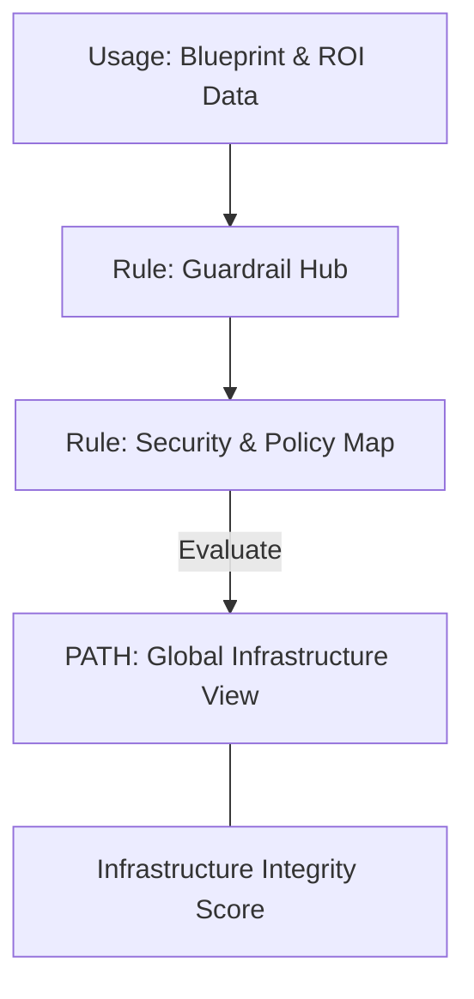

### 5. Multi-Cloud Infrastructure Federation & Governance Flow
Automatically managing unified infrastructure standards across global regions and diverse cloud tenants, ensuring institutional data residency and privacy boundaries by default.

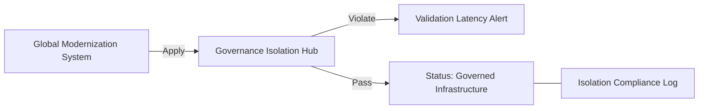

### 6. Encryption & Perimeter Protection Flow (Bicep Standard)
Managing the lifecycle of an infrastructure request, automatically enforcing institutional TLS 1.3 and resource encryption standards as required by security policy, ensuring zero-latency security confidence.

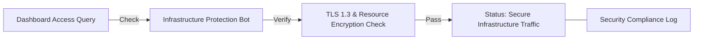

### 7. Institutional Infrastructure Maturity Scorecard
Grading organizational performance based on key indicators: Deployment Consistency Index, Security Linting Index, and IaC Adoption Scores.

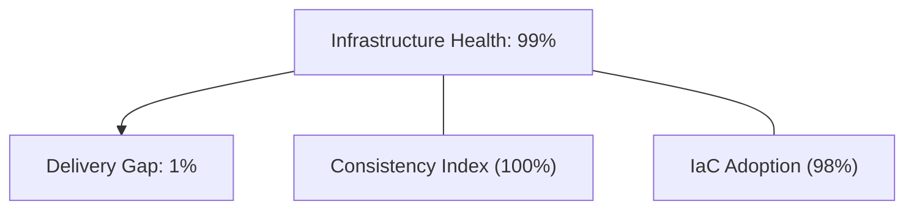

### 8. Identity & RBAC for Infrastructure Governance
Managing fine-grained access to infrastructure hubs, provisioning workers, and audit logs between CTOs, Platform Engineers, and Cloud Architects.

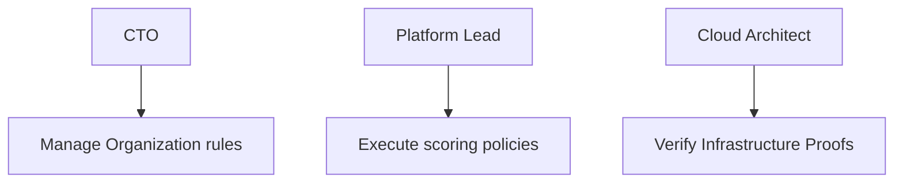

### 9. IaC Deployment: Bicep-Modules-as-Code Framework
Using modular Terraform to deploy and manage the versioned distribution of the infrastructure tracking hubs, sync protection workers, and forensic metadata lakes.

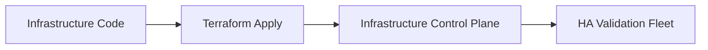

### 10. AIOps Infrastructure Drift & Risk Validation Flow
Using advanced analytics to identify sudden surges in deployment failures, unauthorized module changes, suspicious configuration drifts, or unusual delivery pattern changes that could result in institutional risk or audit failure.

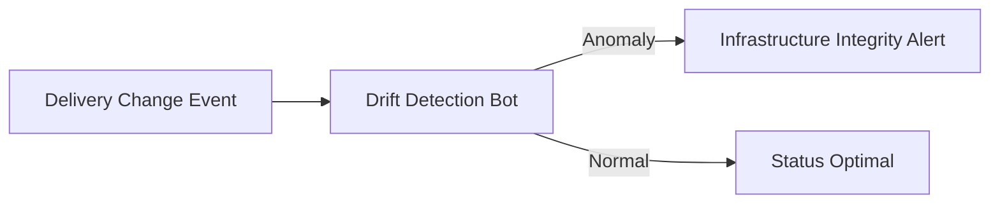

### 11. Metadata Lake for Forensic Infrastructure Audit
Storing long-term records of every infrastructure integration event (metadata), every module published, and every version history for institutional record-keeping, compliance auditing, and post-provisioning forensics.

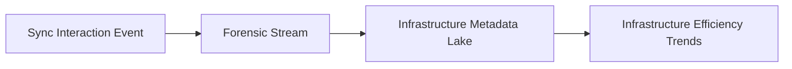

---

## 🏛️ Core Governance Pillars

1.  **Unified Foundation Coordination**: Maximizing resilience by centralizing all infrastructure measurement through a single institutional plane.
2.  **Automated Blueprint Provisioning**: Eliminating "manual tracking" scenarios through proactive orchestration and pattern verification.
3.  **Sequential Infrastructure Intelligence**: Ensuring zero-interruption operations through dependency-aware deployment-driven data engineering.
4.  **Zero-Trust Identity Protection**: Automatically enforcing identity-based access, data-at-rest encryption, and policy evaluation across all assurance tiers.
5.  **Autonomous Operations Logic**: Guaranteeing reliability through automated industry-specific effectiveness monitoring runbooks.
6.  **Full Infrastructure Auditability**: Immutable recording of every module change and infrastructure provision for institutional forensics.

---

## 🛠️ Technical Stack & Implementation

### Infrastructure Engine & APIs
*   **Framework**: Python 3.11+ / FastAPI.
*   **Performance Engine**: Custom Python-based logic for multi-cloud registry reconciliation and DORA-style infrastructure metrics.
*   **Integrations**: Native connectors for Azure Container Registry (ACR), GitHub Actions, and Bicep toolchains.
*   **Persistence**: PostgreSQL (Infrastructure Ledger) and Redis (Live Validation State).
*   **Auth Orchestrator**: Federated OIDC/SAML for least-privilege infrastructure management access.

### Governance Dashboard (UI)
*   **Framework**: React 18 / Vite.
*   **Theme**: Dark, Slate, Indigo (Modern high-fidelity productivity aesthetic).
*   **Visualization**: D3.js for delivery topologies and Recharts for ROI velocity analytics.

### Infrastructure & DevOps
*   **Runtime**: AWS EKS or Azure Kubernetes Service (AKS) for management plane.
*   **Measurement Hub**: Managed event sourcing for immutable productivity timeline reconstruction.
*   **IaC**: Modular Terraform for deploying the infrastructure landing zone and validation fleet.

---

## 🏗️ IaC Mapping (Module Structure)

| Module | Purpose | Real Services |
| :--- | :--- | :--- |
| **`infrastructure/registry_hub`** | Central management plane | EKS, PostgreSQL, Redis |
| **`infrastructure/enforcers`** | Distributed module provisioners | Azure, AWS, GCP APIs |
| **`infrastructure/blueprint_pipes`** | Data Ingestion Hubs | Webhooks, Lambda |
| **`infrastructure/auditing`** | Forensic modernization sinks | S3, Athena, Quicksight |

---

## 🚀 Deployment Guide

### Local Principal Environment
```bash
# Clone the Azure Bicep Modules repository
git clone https://github.com/devopstrio/bicep-modules.git
cd bicep-modules

# Configure environment
cp .env.example .env

# Launch the Infrastructure stack
make init

# Trigger a mock infrastructure update and automated guardrail validation simulation
make simulate-publish
```

Access the Management Portal at `http://localhost:3000`.

---

## 📜 License
Distributed under the MIT License. See `LICENSE` for more information.

---
<div align="center">
  <p>© 2026 Devopstrio. All rights reserved.</p>
</div>
