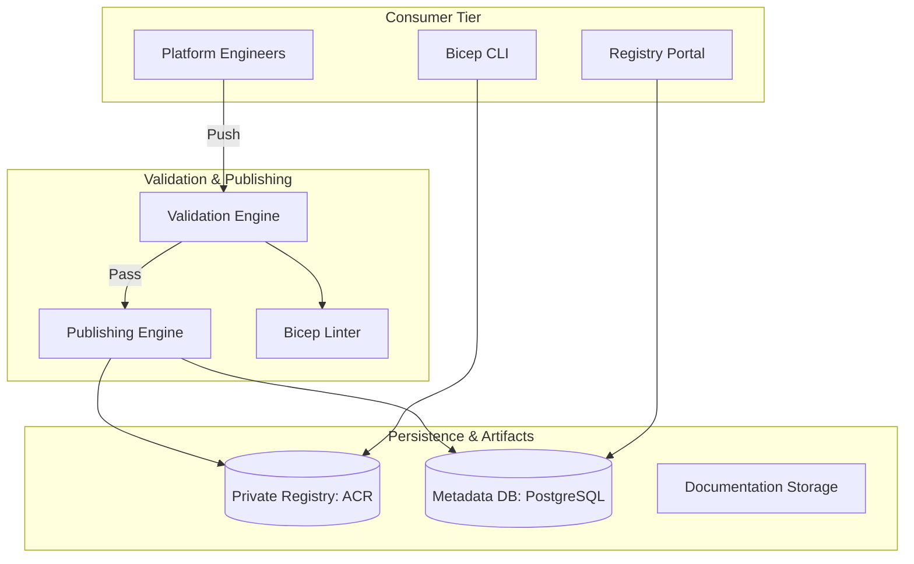
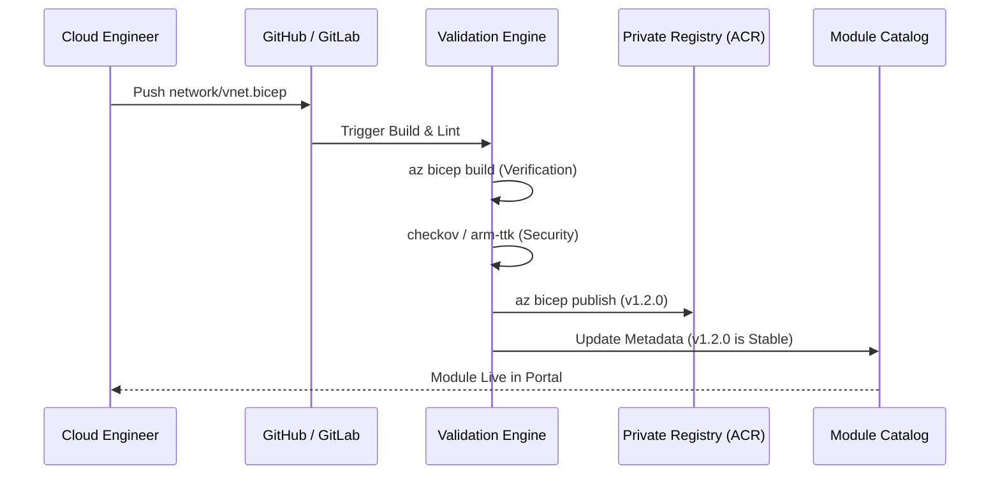
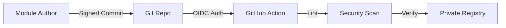
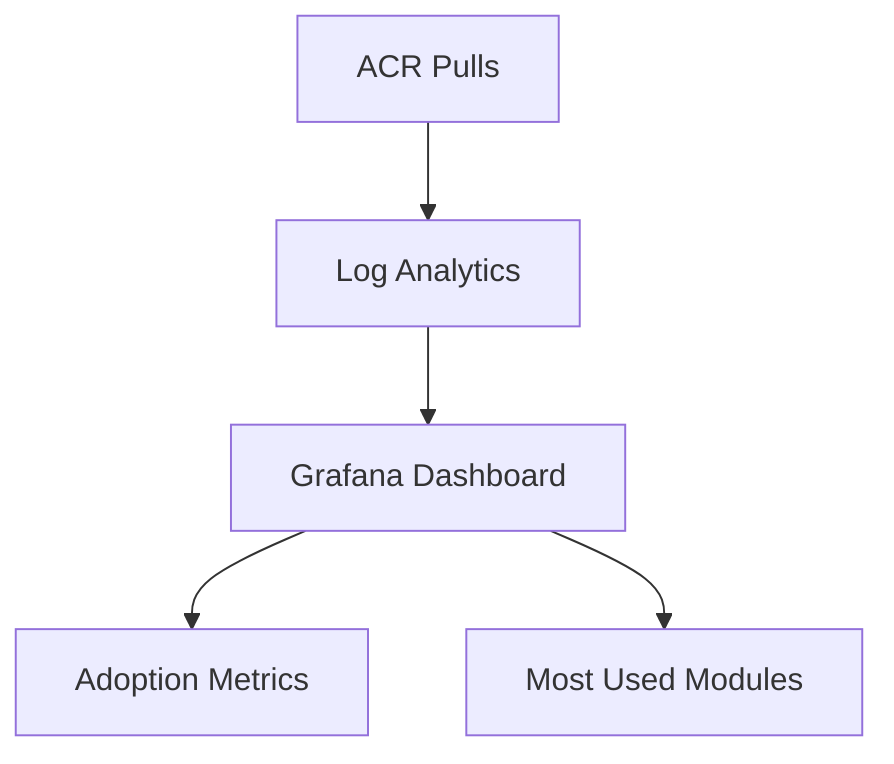

<div align="center">


<h1>Azure Bicep Modules</h1>

<p><strong>The Enterprise Flagship Platform for Reusable Infrastructure-as-Code, Hardened Landing Zones, and Governed Blueprints</strong></p>

[]()
[]()
[]()
[]()

<br/>

> **"Code once, deploy everywhere—securely."** 
> Azure Bicep Modules is an institutional-grade IaC factory designed to provide platform engineering teams with a library of pre-validated, secure, and versioned cloud building blocks.

</div>

---

## 🏛️ Executive Summary

The **Azure Bicep Modules** platform is the definitive destination for enterprise-ready cloud architecture. By moving from ad-hoc scripts to a centralized, semantic-versioned module registry, organizations can achieve 100% deployment consistency while enforcing strict governance-as-code from the first day of development.

### 🚀 Strategic Business Outcomes
- **Accelerate Time-to-Value**: Deploy complex AI and Data platforms in minutes using pre-stitched "Compositions."
- **Institutional Governance**: Automatically enforce naming conventions, tagging, and private-link networking at the source.
- **Reduce Operational Risk**: Every module undergoes automated "What-If" analysis and security linting before being published.
- **Unified Cloud Footprint**: Achieve perfect standardization across thousands of subscriptions using a single source of truth for IaC.

---

## 🏗️ High-Level Architecture

The platform centers on a **Private Module Registry (ACR)** orchestrated by a metadata-rich Control Plane.



### 💉 Module Lifecycle (Dev to Pub)



---

## 📐 Intellectual Asset Domains

| Domain | Focus | Key Module |
|:---:|:---|:---|
| **Networking** | Connectivity & Routing | Hub-Spoke VNet, vWAN |
| **Security** | Identity & Protection | Key Vault, Managed ID |
| **Compute** | High-Density Platforms | AKS Cluster, Container Apps |
| **AI Platform** | GenAI Foundation | OpenAI, AI Search |
| **Data** | Persistence & Lakes | PostgreSQL, Cosmos DB |

---

## 📂 Repository Structure

```text
bicep-modules/
├── apps/
│   ├── portal/             # Next.js 14 Module Catalog Dashboard
│   ├── api/                # FastAPI Registry Gateway
│   ├── validation-engine/  # Bicep Lint & What-If Workers
│   └── publishing-engine/  # Semantic Versioning & ACR Push
├── modules/                # Reusable Bicep Source Code
│   ├── network/            # VNet, Subnet, Firewall
│   ├── security/           # KeyVault, ManagedID
│   ├── compute/            # AKS, AppService
│   └── ai/                 # OpenAI, AI Search
├── compositions/           # High-level Blueprints (App Landing Zones)
├── database/               # SQL schema for Module Metadata
├── terraform/              # Infra for the Registry itself
├── .github/workflows/      # Factory CI/CD Pipelines
└── README.md               # Flagship Product Documentation
```

---

## 🚀 Usage & Deployment Guide

### 1. Consuming a Module in your code
Reference the enterprise registry in your local Bicep files.

```bicep
module vnet 'br:acrbicepdtrio.azurecr.io/bicep/modules/network/vnet:v1.2.0' = {
  name: 'vnet-deploy'
  params: {
    vnetName: 'vnet-prod-uks'
    location: 'uksouth'
  }
}
```

### 2. Initializing the Registry Infrastructure
Provision the ACR and metadata databases using Terraform.

```bash
cd terraform
terraform init
terraform apply -var="registry_name=dtrio"
```

---

## 🛡️ Security & Supply Chain



- **Identity**: OIDC-based authentication for publishing (No service principal keys).
- **Hardening**: Every module is audited against the **CIS Microsoft Azure Foundation Benchmark**.
- **Signing**: Support for signed Bicep artifacts to ensure provenance.

---

## 📈 Platform Monitoring



- **Dashboards**: Visualize which Business Units are using which module versions.
- **Alerting**: Immediate notification if a version is pulled after being marked as deprecated or insecure.

---

## 🤝 Support & Roadmap
- **Module Requests**: platform@devopstrio.com
- **Enterprise Status**: [Status Page](https://status.devopstrio.com)

<div align="center">


**Building the future of enterprise infrastructure — one blueprint at a time.**

</div>
